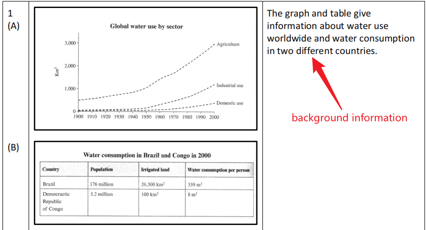

## 写作评分标准

1. Task Response: 完整回答问题，涵盖所有要点
2. Coherence and Cohesion: 文章结构清晰，段落之间逻辑连贯，使用合适的连接词
3. Lexical Resource: 使用了丰富的词汇，准确地使用词汇表达观点
4. Grammatical Range and Accuracy: 使用了多样化的语法结构，语法错误是否影响理解

**时间分配：** Task 1约20分钟，完成180词，Task 2约40分钟完成280词

## Task 1

根据给出的**图表、表格、地图或流程图**等信息，写一篇150字左右的报告，对信息进行描述和总结。重点在于准确地理解和呈现数据、趋势或过程。

### 四段式结构

- para.1 改写background information
  
  常用句式：The first/top ... shows ... , the second/bottom ... shows (the number/ammount/quantity of) ... Together with ... 
  图表：line graph(折线图), bar chart(柱状图), pie chart(饼状图), table(表), map(地图), diagram/flow chart(流程图)
  类别：category/kind/sort
- para.2 总结最重要的两个要点信息
  通常两张图表，每张总结一个；一张图表则横纵对比、找极值等。  
  常用句式：Overall, there are 2 key points (to note).  
  First,..And secondly,.. *OR* Overall, the main point to note is that…. Overall, the main points to note are that XXX and YYY.
- para.3 & 4 详细讲两个要点
  常用句式：Looking at the first graph in more detail, it can be seen that(we can see that) ...  
  Turning to the ...  
  It is also noteworthy that ...